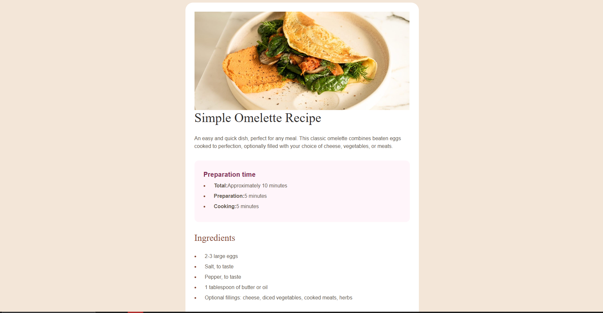
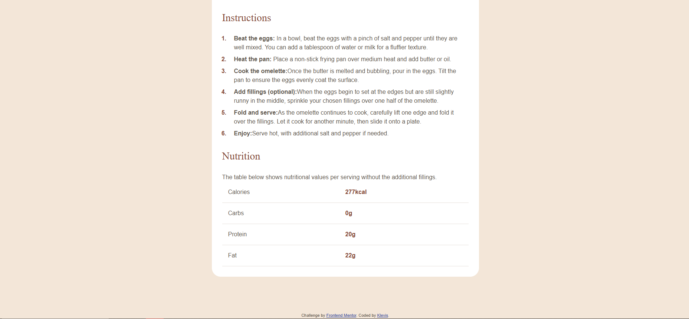

🍳 Recipe Page

A responsive Recipe Page built as part of a Frontend Mentor challenge.
This project focuses on practicing semantic HTML, layout structure, and clean CSS styling while recreating a real UI design.

🚀 Features

- Clean semantic HTML structure
- Responsive layout
- Styled recipe sections
- Ingredients list
- Step-by-step cooking instructions
- Nutrition information table
- Accessible and readable typography

| Technology       | Purpose            |
| ---------------- | ------------------ |
| **HTML5**        | Page structure     |
| **CSS3**         | Styling and layout |
| **Flexbox**      | Layout alignment   |
| **GitHub Pages** | Deployment         |

📸 Screenshot

